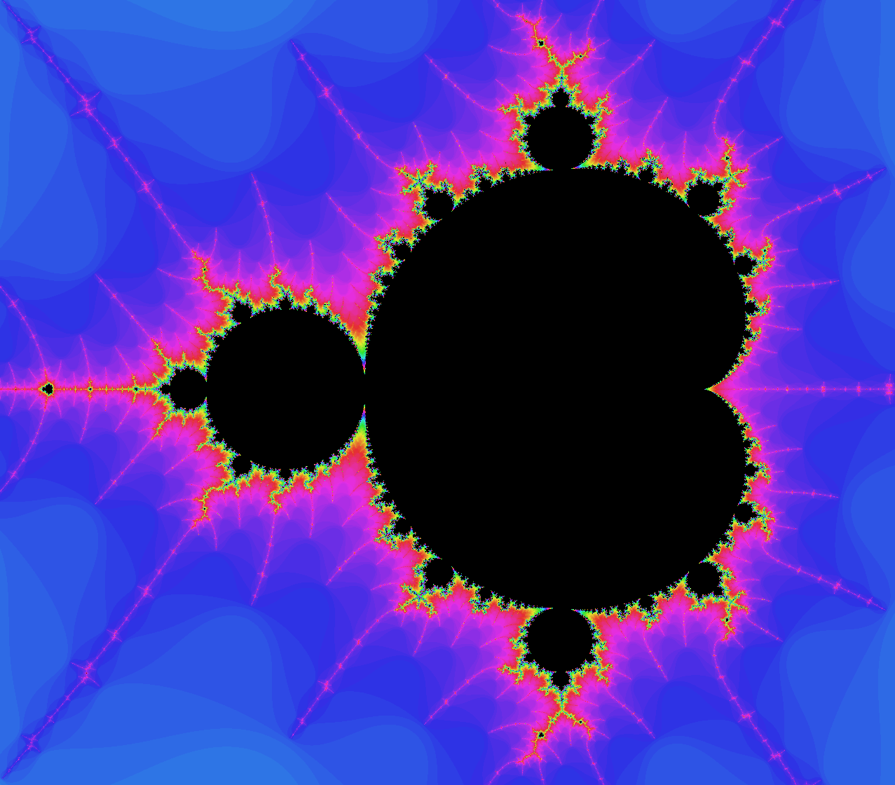

# WebGL Mandelbrot Fractal Explorer

An interactive Mandelbrot set fractal explorer built with WebGL for high-performance rendering. This project allows real-time exploration of the Mandelbrot set with smooth zooming, panning, and color animation.



## Features

- Real-time rendering of the Mandelbrot set using GPU acceleration via WebGL
- Smooth zoom and pan controls with mouse and keyboard support
- Interactive UI with buttons for navigation
- Dynamic color cycling with adjustable animation speed
- Adjustable iteration count to increase and decrease level of detail.
- Screenshot capture functionality.
- FPS counter for real-time performance monitoring.

## How It Works

The application uses WebGL fragment shaders to perform the Mandelbrot set calculations on the GPU. For each pixel:

1. The complex plane coordinates are calculated based on the current view parameters
2. The Mandelbrot iteration algorithm determines if the point is in the set
3. Points are colored based on iteration count and color animation settings

## Controls

### Mouse
- **Drag**: Pan around the fractal
- **Scroll wheel**: Zoom in/out centered on cursor position

### Keyboard
- **Arrow keys**: Move around the fractal
- **+/-**: Zoom in/out
- **A**: Toggle color animation
- **</>**: Decrease/increase animation speed
- **[/]**: Decrease/increase iterations
- **C**: Change color (when animation is disabled)
- **R**: Reset view to default position

## Getting Started

### Prerequisites
- A modern web browser with WebGL support

### Running Locally
1. Clone this repository
2. Serve the files using a local server:
```
cd src
python -m http.server
```
Then navigate to `http://localhost:8000`

### Use it online
- Go to [https://fractal.andrescosta.com](https://fractal.andrescosta.com)

## Project Structure

- `src/index.html` - Main HTML page
- `src/main.js` - Core application logic and control setup
- `src/style.css` - Application styling
- `src/modules/` - JavaScript modules for WebGL functionality
  - `draw-scene.js` - Rendering logic
  - `init-buffers.js` - Buffer initialization
  - `shader-utils.js` - Shader program utilities
- `src/shaders/` - GLSL shader code
  - `vertex-shader.js` - Simple vertex shader
  - `mandelbrot-fragment-shader.js` - Mandelbrot computation shader

## Future Improvements

- Julia set visualization option
- Save/load specific views

## License

This project is open source and available under the MIT License.

## Acknowledgments

- The WebGL programming model
- The mathematical beauty of the Mandelbrot set

## Support the Project

If you find this project helpful, consider buying me a coffee!

<a href="https://www.buymeacoffee.com/AndyCosta" target="_blank"></a>